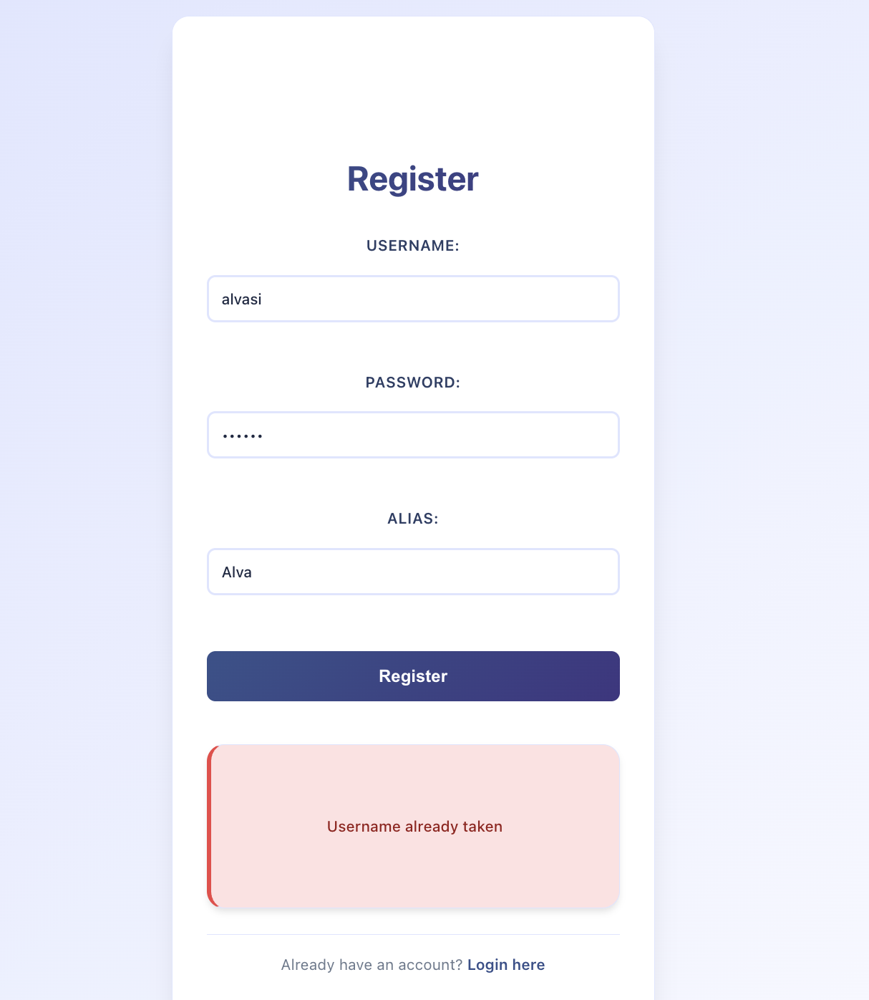
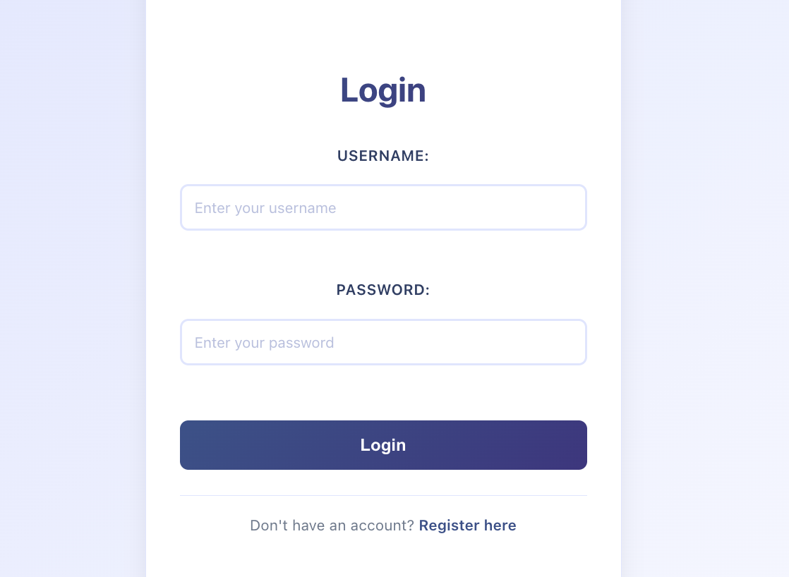
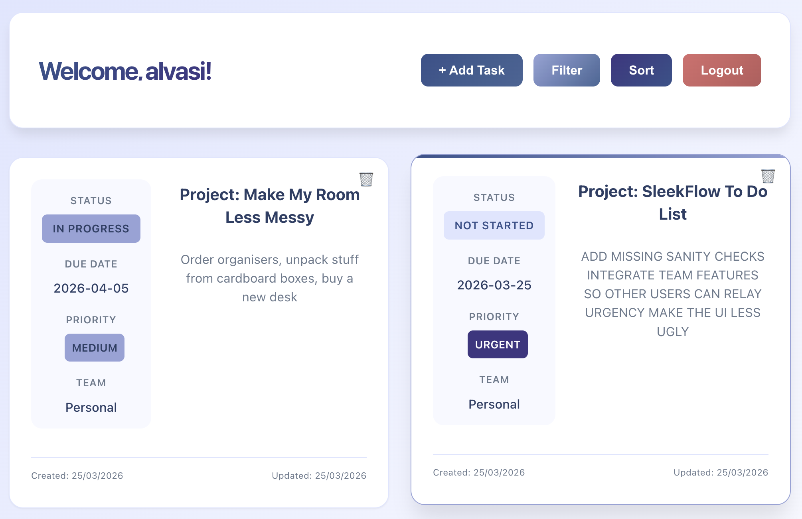
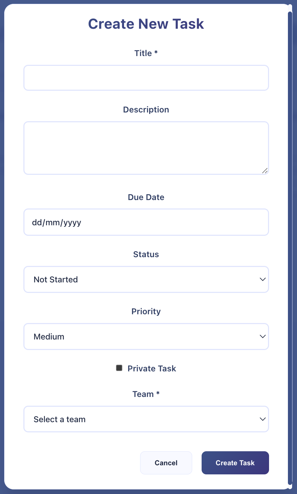
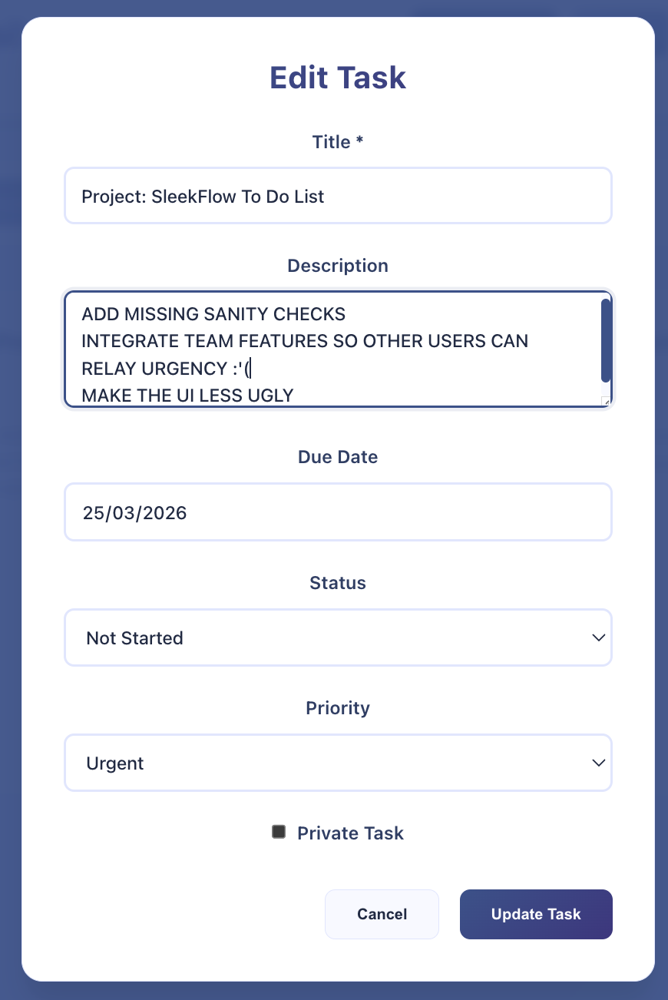
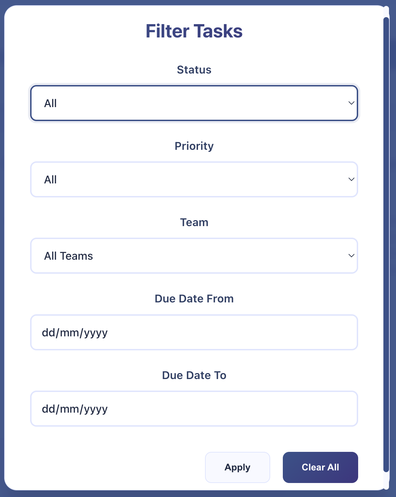
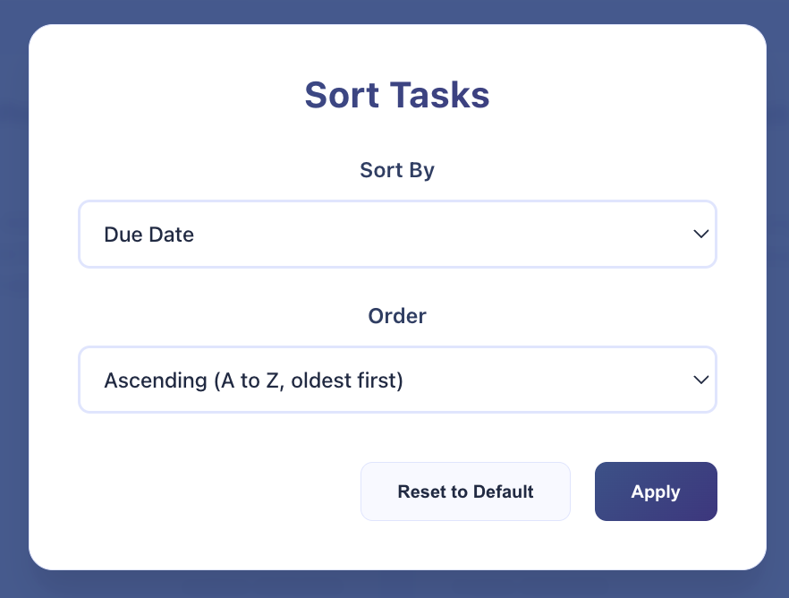
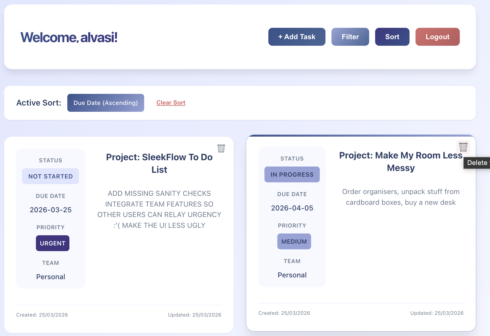
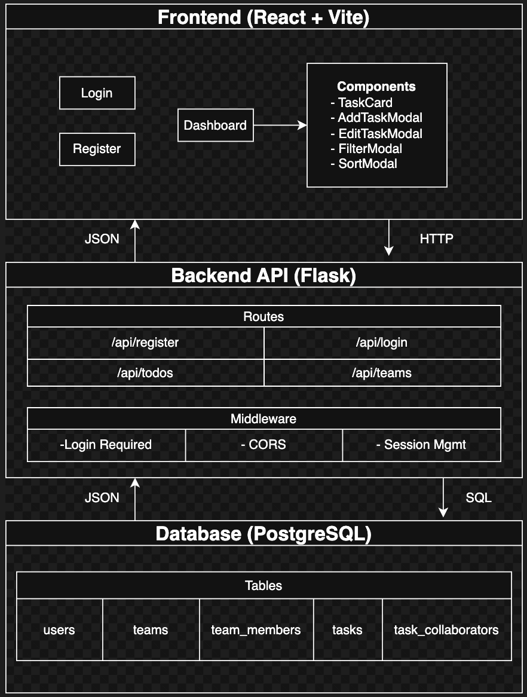
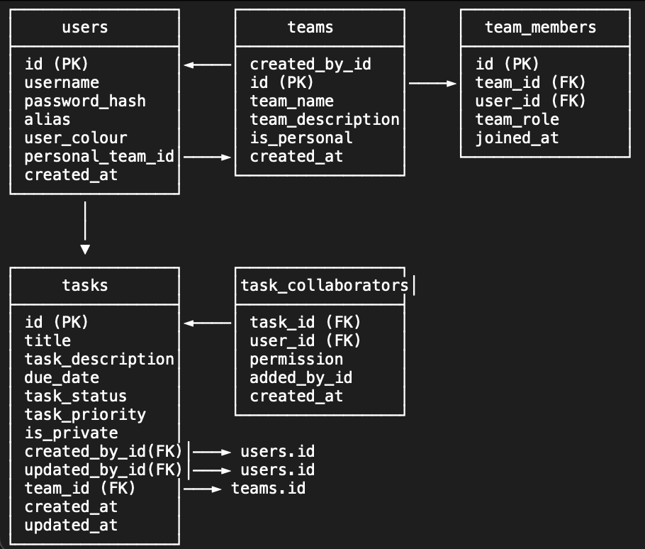

# 📝 To Do List Application

A full-stack todo list application built with React, Flask, and PostgreSQL. The application allows users to create and manage tasks.

## ✨ Features

- 🔐 **User Authentication** - Login and registration with session management
- 📋 **Task Management** - Create, read, update, and delete tasks
- 🏷️ **Filtering & Sorting** - Filter tasks by status, priority, team (under development), and range of due date. Sort tasks by created date, due date, task title, status and priority
- 🎨 **Modern UI** - Clean, responsive design with gradient themes
- 🐳 **Docker Support** - Easy setup with Docker Compose

## 🚀 Quick Start

### Running with Docker

1. **Clone the repository**
   ```bash
   git clone https://github.com/alvasi/todolist.git
   ```
2. **Start the application**
    ```bash
    cd todolist
    docker compose up
    ```
3. **Access the application**  
    http://localhost:5173

4. **Use the application**
- Register as a user, provide a username, password, and what you would like to be called. It will let you know if the username has already been taken.

- Wait for page to redirect to login page

- Login with the credentials you provided on the registration page it will take you to a dashboard

- Click on + Add Task to create new task (for due date there is a calendar widget if you click on the right end side of the input area)

- Click on the task card to edit that task

- Filter and sort the tasks on your dashboard


- Delete the task if you wish to



## Application Architecture



## Database Design



Database is designed to include team features, very extensible.


## API Endpoints and Functionality

### Base URL
- Development: http://localhost:5001

### Authentication
Most endpoints require authentication via session cookies. After successful login, the session cookie is automatically included in subsequent requests.

---

### Authentication Endpoints

### POST /api/register
Register a new user account.

```json
Request Body:
{
  "username": "john_doe",
  "password": "secure_password",
  "alias": "John"
}
```

| Field | Type | Required | Description |
|-------|------|----------|-------------|
| username | string | Yes | Unique username (max 100 chars) |
| password | string | Yes | User password |
| alias | string | No | Display name (defaults to username) |

```json
Response (201 Created):
{
  "message": "User registered successfully",
  "user_id": "123e4567-e89b-12d3-a456-426614174000",
  "team_id": "123e4567-e89b-12d3-a456-426614174001"
}
```

Error Responses:
| Status | Message |
|--------|---------|
| 400 | Username and password are required |
| 409 | Username already taken |
| 500 | Database connection failed / Failed to register user |

---

### POST /api/login
Authenticate a user and create a session.

```json
Request Body:
{
  "username": "john_doe",
  "password": "secure_password"
}
```

| Field | Type | Required | Description |
|-------|------|----------|-------------|
| username | string | Yes | User's username |
| password | string | Yes | User's password |

```json
Response (200 OK):
{
  "message": "Login successful",
  "user": {
    "id": "123e4567-e89b-12d3-a456-426614174000",
    "username": "john_doe",
    "alias": "John",
    "colour": "#000000"
  }
}
```

Error Responses:
| Status | Message |
|--------|---------|
| 400 | Username and password are required |
| 401 | Invalid username or password |
| 500 | Database connection failed / Login failed |

---

### Team Endpoints

### GET /api/teams
Get all teams the authenticated user is a member of.

Headers:
- Cookie: Session cookie (automatically sent)

Query Parameters: None
```json
Response (200 OK):
{
  "teams": [
    {
      "id": "123e4567-e89b-12d3-a456-426614174001",
      "name": "Personal",
      "description": "For your eyes only",
      "is_personal": true,
      "role": "owner",
      "created_at": "2024-01-01T00:00:00Z"
    },
    {
      "id": "123e4567-e89b-12d3-a456-426614174002",
      "name": "Work Team",
      "description": "Team for work projects",
      "is_personal": false,
      "role": "member",
      "created_at": "2024-01-02T00:00:00Z"
    }
  ]
}
```

Error Responses:
| Status | Message |
|--------|---------|
| 401 | Authentication required |
| 500 | Database connection failed / Failed to fetch teams |

---

### Task Endpoints

### GET /api/todos
Get all tasks where the authenticated user is a collaborator.

Headers:
- Cookie: Session cookie (automatically sent)

Query Parameters:

| Parameter | Type | Description | Example |
|-----------|------|-------------|---------|
| status | string | Filter by task status | ?status=in_progress |
| priority | string | Filter by priority | ?priority=high |
| team_id | string | Filter by team ID | ?team_id=uuid |
| due_date_from | date | Tasks due after this date (YYYY-MM-DD) | ?due_date_from=2024-01-01 |
| due_date_to | date | Tasks due before this date (YYYY-MM-DD) | ?due_date_to=2024-12-31 |
| sort_by | string | Field to sort by | ?sort_by=created_at |
| sort_order | string | Sort direction (asc/desc) | ?sort_order=desc |

Valid sort_by values:
- created_at - Creation date
- due_date - Due date
- title - Task title
- task_status - Status
- priority - Priority

```json
Response (200 OK):
{
  "tasks": [
    {
      "id": "123e4567-e89b-12d3-a456-426614174000",
      "title": "Complete project documentation",
      "description": "Write comprehensive API documentation",
      "due_date": "2024-12-31",
      "task_status": "in_progress",
      "task_priority": "high",
      "is_private": false,
      "team_id": "123e4567-e89b-12d3-a456-426614174002",
      "team_name": "Work Team",
      "permission": "owner",
      "created_at": "2024-01-01T00:00:00Z",
      "updated_at": "2024-01-02T00:00:00Z"
    }
  ]
}
```

Error Responses:
| Status | Message |
|--------|---------|
| 401 | Authentication required |
| 500 | Failed to fetch tasks |

---

### POST /api/todos
Create a new task.

Headers:
- Cookie: Session cookie (automatically sent)
- Content-Type: application/json

```json
Request Body:
{
  "title": "Complete project",
  "task_description": "Finish the todo app",
  "due_date": "2024-12-31",
  "task_status": "not_started",
  "task_priority": "medium",
  "is_private": false,
  "team_id": "123e4567-e89b-12d3-a456-426614174002"
}
```

| Field | Type | Required | Default | Description |
|-------|------|----------|---------|-------------|
| title | string | Yes | - | Task title (max 200 chars) |
| task_description | string | No | null | Detailed description |
| due_date | date | No | null | Task deadline (YYYY-MM-DD) |
| task_status | string | No | not_started | Status: not_started, in_progress, completed, archived |
| task_priority | string | No | medium | Priority: low, medium, high, urgent |
| is_private | boolean | No | false | Whether task is private |
| team_id | string | Yes | - | Team ID (must be a team the user belongs to) |

```json
Response (201 Created):
{
  "message": "Task created successfully",
  "task_id": "123e4567-e89b-12d3-a456-426614174000"
}
```

Error Responses:
| Status | Message |
|--------|---------|
| 400 | Title is required / Team ID is required |
| 401 | Authentication required |
| 403 | You are not a member of this team |
| 404 | Team not found |
| 500 | Failed to create task |

---

### PATCH /api/todos/{task_id}
Update an existing task (partial update). Requires edit or owner permission.

Headers:
- Cookie: Session cookie (automatically sent)
- Content-Type: application/json

URL Parameters:
| Parameter | Type | Description |
|-----------|------|-------------|
| task_id | string | UUID of the task to update |

```json
Request Body: (any combination of fields)
{
  "title": "Updated project title",
  "task_description": "Updated description",
  "due_date": "2025-01-15",
  "task_status": "completed",
  "task_priority": "urgent",
  "is_private": true
}
```

| Field | Type | Description |
|-------|------|-------------|
| title | string | New task title |
| task_description | string | New description |
| due_date | date | New due date (YYYY-MM-DD) |
| task_status | string | New status |
| task_priority | string | New priority |
| is_private | boolean | New privacy setting |

```json
Response (200 OK):
{
  "message": "Task updated successfully",
  "task": {
    "id": "123e4567-e89b-12d3-a456-426614174000",
    "title": "Updated project title",
    "task_status": "completed",
    "task_priority": "urgent",
    "updated_at": "2024-01-03T00:00:00Z"
  }
}
```

Error Responses:
| Status | Message |
|--------|---------|
| 400 | No data provided / Invalid status / Invalid priority |
| 401 | Authentication required |
| 403 | Insufficient permissions to update this task |
| 404 | Task not found |
| 500 | Failed to update task |

---

### DELETE /api/todos/{task_id}
Deletes a task. Requires owner level permission.

Headers:
- Cookie: Session cookie (automatically sent)

URL Parameters:
| Parameter | Type | Description |
|-----------|------|-------------|
| task_id | string | UUID of the task to delete |

```json
Response (200 OK):
{
  "message": "Task deleted successfully",
  "task_id": "123e4567-e89b-12d3-a456-426614174000"
}
```

Error Responses:
| Status | Message |
|--------|---------|
| 401 | Authentication required |
| 403 | Only task owners can delete tasks |
| 404 | Task not found |
| 500 | Failed to delete task |

---

### Status Codes Summary

| Status Code | Description |
|-------------|-------------|
| 200 | OK - Request successful |
| 201 | Created - Resource created successfully |
| 400 | Bad Request - Invalid input or missing required fields |
| 401 | Unauthorized - Authentication required or invalid credentials |
| 403 | Forbidden - Insufficient permissions |
| 404 | Not Found - Resource not found |
| 409 | Conflict - Resource already exists (e.g., duplicate username) |
| 500 | Internal Server Error - Server-side error |

---

### Task Status Values

| Value | Display | Description |
|-------|---------|-------------|
| not_started | Not Started | Task hasn't been started |
| in_progress | In Progress | Task is currently being worked on |
| completed | Completed | Task is finished |
| archived | Archived | Task is archived and no longer active |

---

### Task Priority Values

| Value | Display | Description |
|-------|---------|-------------|
| low | LOW | Low priority - can be done when time allows |
| medium | MEDIUM | Medium priority - should be done soon |
| high | HIGH | High priority - important to complete |
| urgent | URGENT | Urgent - needs immediate attention |

---

### Permission Levels

| Permission | Can View | Can Edit | Can Delete | Description |
|------------|----------|----------|------------|-------------|
| owner | Yes | Yes | Yes | Task creator - full control |
| edit | Yes | Yes | No | Can view and edit, cannot delete |
| view | Yes | No | No | Read-only access |


## Notes

1. Session Management: After login, the session cookie is automatically sent with all subsequent requests when using credentials: 'include' in fetch.

2. CORS: The API supports CORS with credentials for local development (http://localhost:5173).

3. Date Format: All dates should be in ISO format (YYYY-MM-DD) for requests. Responses return dates in ISO 8601 format.

4. UUID Format: All IDs are UUID v4 strings.


## Immediate Next Steps

1. Fix the sort task options (clearer asc and desc descriptions)
2. Hide archived tasks or add a current filter (with overdue tasks)
3. Allow user to create teams and add other users
4. Hash the password
5. Add stricter type checks for API endpoint inputs (enum)
6. Refactor test suite
